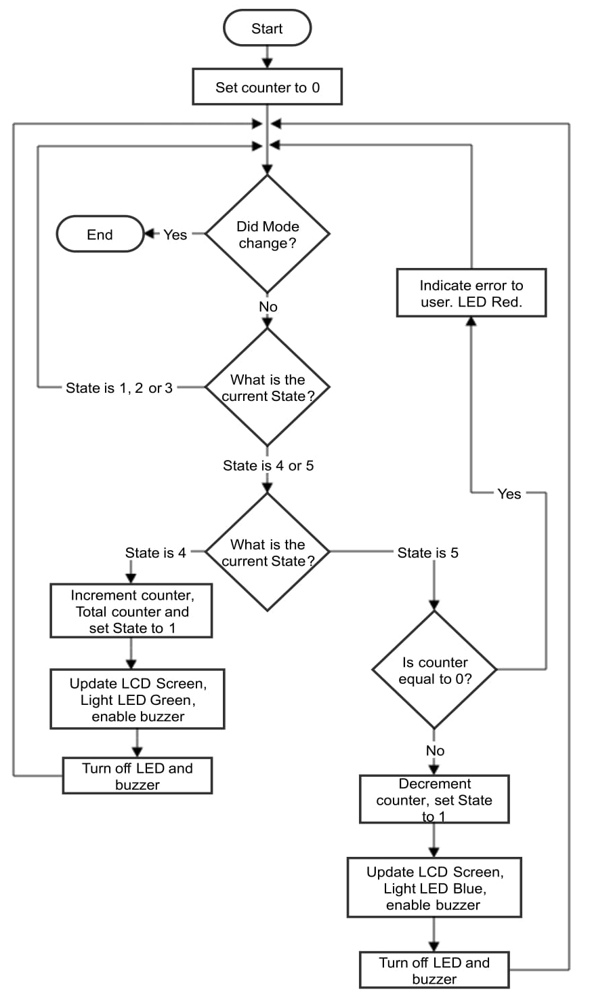
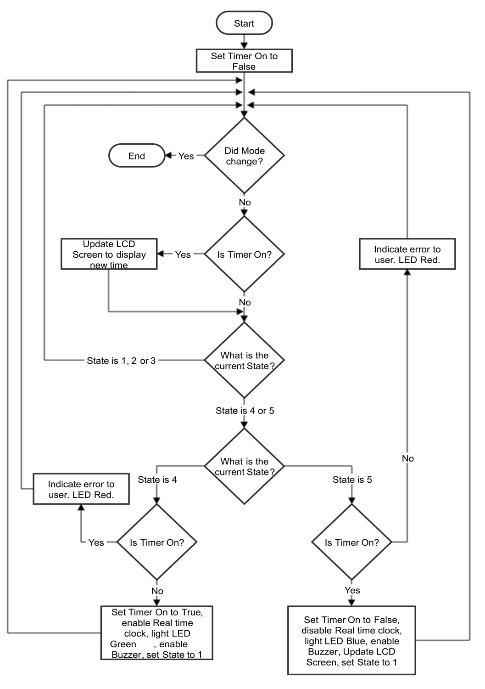
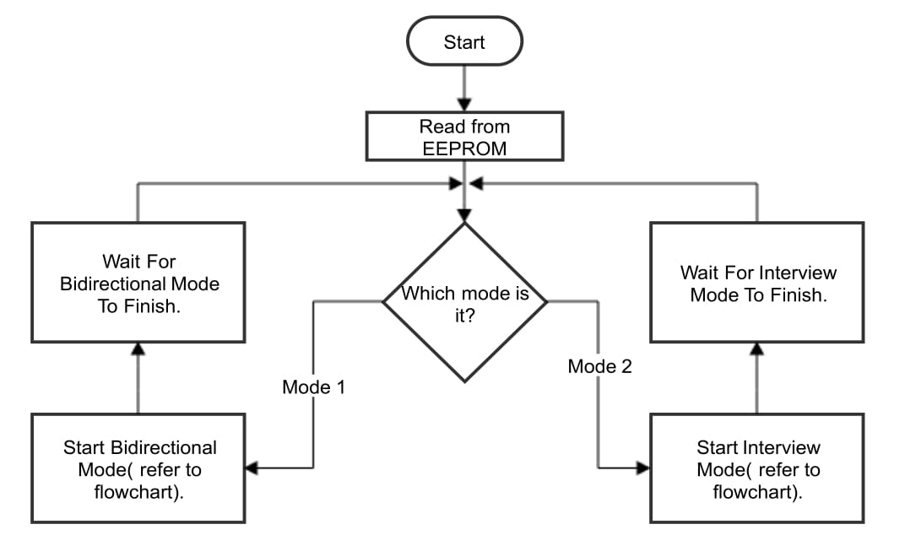

# Bidirectional Visitor Counter and Timer Microcontroller

Bidirectional Visitor Counter and Timer using Embedded Artists LPC4088 experiment bundle Microcontroller. The project consist of two modes which can be switched at any time by the user using the switch button.

The Bidirectional Visitor Counter mode (or mode 1) is designed to count the number of visitors at a stadium, offices, parking lot, malls, clubs and plenty other uses. The system provides a mechanism to consider both arrival and departure from the venue by having multiple sensors. Depending on which sensor is interrupted first, the system identifies whether it is an arrival or a departure. The present number of visitors can be seen at any given point on a small LCD screen along with the total visitors in that session. This mode provides an efficient manner to control the number of visitors in a venue if the amount of visitors is limited. Manually counting the amount of visitors in a venue is time consuming and error prone. 

The Interview mode is mode 2. It is designed to indicate the amount of time taken from an arrival to its departure. The system assumes that the room is initially empty and only one person may be inside the room at any given time. Therefore, any other arrival after the first arrival will be ignored until there is a departure. Like wise, if the room is empty, any further triggered departures are ignored considered erroneous operation. This mode provides an efficient approach to calculate some of the characteristics needed for queueing theory such as calculating the service time for a single server queue.

## Design

The system design will consist of the appendix requirements, the additional hardware components and their connection to the microcontroller, the partitioning of software into individual components and the interaction between the hardware and software. 

### Hardware Components and Their Connections

The hardware of the system will consist of two infrared sensors, one switch, one LCD screen (2x16), a RGB LED, a buzzer and the microcontroller itself (ARM Cortex M4 LCP4088).

* The IR module will be used to detect the arrival or departure of a body through the frame. When one of the sensors is triggered, an interrupt is sent to the microcontroller. Otherwise system remains in a ready state. The pins used for these IR modules are pin 8 and 9 (P0.21 and P0.0) for control and pins 44 and 22 for supply and ground of each component.

* The switch built into the board shall be used to change the system between the two modes of operation. This on-board switch is internally connected to P2.10.

* The LCD screen shall be used to display different things for different modes. For mode 1, the count of people inside the room as well as the total visiting people for a whole session, and for mode 2, the current state of the room (occupied or not occupied) and the time the guest has been inside the room (if not occupied, the previous time is displayed). The LCD will be using the SPI bus, connected with the 16 pin expansion slot expecting the LCD screen. These are connected with pin 5,7 and 30 of the MicroController (P1.24, P1.20 and P1.2). These connections are found defined in the driver code for the LCD screen.

* The buzzer shall be triggered whenever there is an arrival or a departure in both modes of operation. According to the Buzzer type, it may be activated by a logic 1 or a logic 0. When a person arrives, the appropriate logic value is sent using a GPIO pin. The pin used for the buzzer will be pin 10 (P0.1).

### Partition of Software into Individual Components

The below figure shows how the several modules are interconnected together. Each module is separated into smaller modules. For this program, there are 3 main modules which are the following: 

1. Bus, Pin Declaration and Drivers module takes care of the communication done with the hardware. For this program, GPIO is used as a bus interface with the microcontroller. Platform will contain all the pin declarations. EEPROM, Timer and Real Time Clock are drivers used to communicate with the resources of the microcontroller.

1. Components Interface module provides an easier interface with the given drivers. The interface provided is applied for this specific program. Some of the smaller modules will use the Delay module to delay a specific action for a given time. This module needs to communicate with the Bus, Pin Declaration and Drivers module to have access to the drivers, their pins and bus.

1. Controller is used to operate the current Mode it is on. The Controller's main job is to use the provided drivers interface to do the current action it needs. The interrupts are also managed by the ISR module found in the Controller.

The Main module is used to determine the initial starting mode taken from EEPROM. When the mode is read, the control is passed to the Controller. Whenever a switch interrupt is triggered, the Main re-takes control, switches the mode and gives control back to the Controller.

### Interaction between Hardware and Software

In this section interrupts and how the software handles the interrupts will be discussed.

#### Interrupts

There are 3 ways interrupts can occur in the system. These are:

1. Switch interrupt can occur whenever someone presses the switch. This switch uses port 2 for interrupts. This interrupt will cause the mode to change by changing a global variable.

1. A period is specified for the timer. An interrupt is caused by the timer whenever the timer is enabled and is not disabled for that specified period. This interrupt is used to check for failed arrival or departure. A separate ISR is used for timer interrupts.

1. The IR Modules can cause an interrupt if they detect an object. The IR Modules uses port 0 for interrupts. The IR Modules interrupts control the flow of the program and will be discussed in more detail.

The above figure shows the state diagram used for the IR Modules interrupts. Depending on the initial interrupt of the IR Module, an arrival or departure is validated. When the system is in state 2 or 3, a timer is used. The timer will be active for a specified period and if the period is exceeded, an interrupt is triggered. The time-out is expected to be amended according to the application of the system, due to the size of the door and the density of people expected. The interrupt will cause the system to return to state 1 and indicate an error to the user. After servicing an interrupt, the actions depended on the current state is completed. If the system is on state 1,2 or 3 nothing is done and the system waits for more interrupts. The actions on state 4 and 5 depend on the current mode. Further details in the next Section. 

It is important to mention that having the system function mainly on interrupts makes the system far quicker to react to external changes, as well as function more economically since for most of the time, the system is dormant.

#### Software Actions Regarding Interrupts

The figure below shows the flow of program for the Bidirection Visitor Counter. When Bidirectional visitor counter mode is selected, the counter is set to 0. The program will keep looping until the mode is changed. When the mode is changed, the system goes to Interview mode. For Bidirection Visitor Counter, State 4 indicates an arrival. When an arrival occurs, the counter is incremented and peripherals are activated to show an arrival. State 5 indicates a departure. When a departure occurs, the counter is checked if it is 0 or less. If so the user is notified with the error. Otherwise the counter is decremented and the peripherals are activated to show a departure. It is important to note to reset the current State to State 1 so more arrivals or departures can be handled. This is not done by the ISR but it is done by the code that does the actions for that current State (polling on the current state).

The next figure shows the second mode of the system which is the Interview mode. When the system is on State 4, it indicates an arrival. When there is an arrival, the variable timer is on is checked to see if the room was already occupied. If so, the arrival is ignored and an error is shown to the user while continuing to show the timer for the other arrival. If the timer is on was not activated beforehand, the variable is switched to true. The peripherals are activated to show an arrival, the current State is reset to State 1 and the LCD Screen will be continuously updated until the system is on State 5. When the system is on State 5, it indicates a departure. The variable timer is on and is checked if it was activated. If it was not activated, an error is shown to the user and the departure is ignored. Otherwise, the variable is switched to false and the peripherals are activated to show a departure. Note that the LCD Screen will show the time spent in the room until there is another arrival. 

The following figure shows the starting of the system and how the 2 modes operate. When the system starts, the previous saved mode is loaded from the EEPROM. Depending on the read mode, the system enters the expected mode. If garbage data is found, the default mode is Bidirectional Visitor Counter (mode 1). When a mode is selected, the flowchart of said mode is ran. The mode will continue to run until there is an interrupt given from the switch causing that flowchart to stop and the flowchart shown in Figure \ref{fig:modeConnecting} regains control. The next mode is then executed by starting the said mode flowchart and repeating the process again. 

